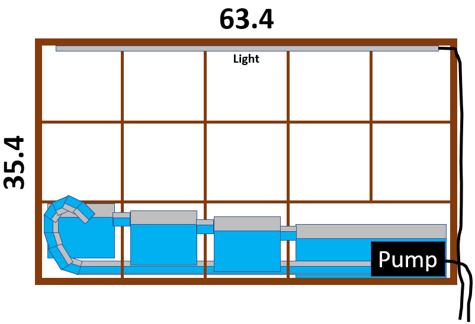

# Hydroponics Project

## About
During the pandemic and the lockdowns, I was interested in indoor gardening. I liked the idea of growing my own food and making my apartment look more green. I got bored of regular plant pots so I thought I would make my hydroponics shelf.

## Plan

I planned the project using MS Powerpoint's Autoshapes. I had a limited budget, but I had a fair amount of free time. I wanted the movement of water to be visible, because I thought it would look nice. I bought a small shelf which could fit the plant light I already owned. I planned to have four different water containers. The containers would be connected by pipes of decrementing heights. The container on the far right would be the water reservoir. In that container a small water pump would carry the water to the far left container. Then the water would pass from container to container until it returned to the reservoir.

## Outcome

I put the shelf together and I stayed close to the plan. I spent a lot of time making the holes in the containers watertight. The first pump I bought was too powerful, so I bought a smaller one which was gentle enough. Once assembled, i used the shelf for a few months.

## Comments

I stopped using the shelf for a few reasons. Firstly, the shelf was prone to flooding. This never happened, but I had to babysit the shelf ensuring the pipes were always clear and the water levels weren't too high. Secondly, because I did not want to flood my apartment I would not run it 24/7. This made the water stagnate at times and in the end some parasites got into the water, presumably from one of the shop bought plants. This was quite disgusting and it made be abandon the project. In a future project, I would design it in a way so that it wouldn't be prone to flooding and I would have a backup container, encase the water did ever get out. I would also have the pump running the whole time. Finally, I would start of with just the seeds of plants. Putting fully grown shop bought plants into my system brought parasites into the water, which again was gross. Also, the shelf was not very asthetically pleasing, instead it looked like a science project gone wrong. There was also not much room for the plants to grow.
